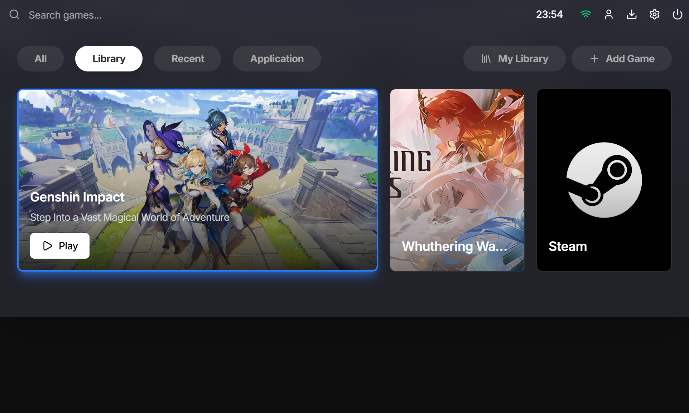

# MikoLauncher




**MikoLauncher** is a lightweight, cross-platform launcher built with C++ and CEF (Chromium Embedded Framework).  
It provides a fast, modern interface for embedding web-based UIs into a native application with GPU-accelerated rendering.

---

## ⚡ Features

- 🚀 **High Performance**: Native C++ backend with CEF off-screen rendering (OSR)  
- 🎨 **Modern WebUI**: React + TypeScript frontend, bundled with Vite  
- 🖼️ **SDL3 Compositor**: GPU-based compositor for multiple WebViews and overlays  
- 🛠️ **CMake + Bun Integration**: Streamlined build workflow for frontend & backend  
- 📦 **Binary Resource Provider**: Embed web assets directly into the application  

---

## 🏗️ Architecture

```

MikoLauncher/
├── main.cpp
│
├── cefview/              # CEF integration
│   ├── app.cpp/.hpp      # CEF App, custom schemes
│   ├── client.cpp/.hpp   # CEF Client + OSR render handler
│
├── compositor/           # SDL3-based GPU compositor
│   ├── sdlcomp.cpp/.hpp
│
├── global/
│   ├── config.hpp        # Runtime configuration
│   ├── logger.cpp/.hpp   # Logging system
│
├── internal/             # Core services
│   ├── downloadmanager.\* # Asset/game downloader
│   ├── fs.\*              # Filesystem utilities
│   ├── gamemanager.\*     # Game process manager
│   ├── ipc.\*             # IPC bridge for Web ↔ Native
│
└── resources/
├── binaryresourceprovider.\*  # Serve embedded web assets
├── resourceutil.\*            # Pack/unpack helpers
├── webapp.\*                  # WebUI entrypoint

````

---

## 🔧 Prerequisites

- **Windows 10/11** with MSVC (Visual Studio 2019 or later)  
- **CMake 3.25+**  
- **Bun.js** (latest version)  
- **Git** with submodule support  

---

## 🚀 Quick Start

### 1. Clone the Repository

```bash
git clone https://github.com/arizkami/mikolauncher.git
cd mikolauncher
````

### 2. Install Dependencies

```bash
bun install
```

### 3. Build the Project

```bash
# Build frontend
bun run build

# Build backend (C++)
bun run build:win
```

### 4. Run

```bash
.\build\Release\MikoLauncher.exe
```

---

## 📜 Development

### Scripts

* `bun run dev` → Start frontend dev server
* `bun run build` → Build production frontend
* `bun run preview` → Preview production frontend
* `bun run build:cmake <project>` → Build backend target
* `bun run clean:cmake <project>` → Clean backend target
* `bun run buildtobin` → Convert web assets into binary blobs
* `bun run iconconvert` → Convert PNG to ICO

---

## ⚙️ Tech Stack

* **Frontend:** React, TypeScript, Vite
* **Backend:** C++17, CEF (OSR mode), SDL3
* **Build Tools:** CMake + Bun.js
* **Resource Pipeline:** Embedded binary assets via custom provider

---

## 📌 Notice

This project is an independent launcher experiment.
It is **not affiliated with or endorsed by Hoyoverse, Kuro Games, or any other third-party company.**

---

## 📄 License

This project is licensed under the MIT License - see the [LICENSE](LICENSE) file for details.

---

✨ **MikoLauncher** – a modern native launcher with web-based UI
